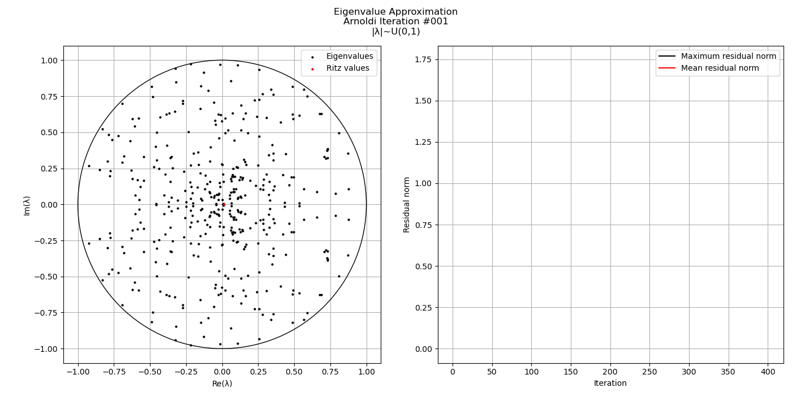

# Arnoldi Iteration

Eigenvalue approximation using the Arnoldi Iteration.

    Figure 1: Convergence of the Ritz values of a random 400x400 matrix
     
    
      

# Setup

Execute the **setup** script located in the top-level directory. The script should create a Conda environment named "arnoldi" from the environment.yml file containing all the necessary packages for building the project. It will then compile all the necessary libraries and executables using CMake, as well as add the libraries to LD_LIBRARY_PATH and the executables to PATH.

# Instructions

Source the **setvars.sh** script inside the **install** directory. This should make the **clock**, **convergence** and **convergence.py** programs available through the command-line.

### clock [--help] [options]

The **clock** program generates a random square matrix with known eigenvalues |λ| ~ U(0,1) and clocks the execution time of the approximation using the Arnoldi Iteration and Francis's QR Algorithm.

Options: 
  - **-m \<N\>** : Size of the linear system (default: 400)
  - **-n \<N\>** : Dimension of the Krylov subspace (default: 400)
  - **-s, --seed \<N\>** : Random seed used for eigenvalue generation (default: 42)
  - **-o, --output \<directory\>** : Output directory (default: ./data/clock)
  - **-h, --help** : Display the help message

The program prints out the time spent executing both of these algorithms, and writes the random matrix, its eigenvalues and the results of the approximation as output.

### convergence [--help] [options]

The **convergence** program will generate a random square matrix with known eigenvalues |λ| ~ U(0,1) and execute Francis's QR Algorithm at each step of the Arnoldi Iteration, creating a history of the approximation.

Options: 
  - **-m \<N\>** : Size of the linear system (default: 400)
  - **-n \<N\>** : Dimension of the Krylov subspace (default: 400)
  - **-s, --seed \<N\>** : Random seed used for eigenvalue generation (default: 42)
  - **-o, --output \<directory\>** : Output directory (default: ./data/convergence)
  - **-h, --help** : Display the help message

The program writes the random matrix, its eigenvalues and the Ritz values obtained in the intermediary steps of the Arnoldi iteration as output. At the end of its execution, it will run the **convergence.py** script and create a graphics presentation of the approximation.

### convergence.py -i \<directory\> [--help] [options]

The **convergence.py** script takes the output of a **convergence** run and creates a gif animation of the approximation.

Options: 
  - **-i, --input \<directory\>** : Input directory containing the output of the 'convergence' executable
  - **-o, --output \<directory\>** : Output directory, defaults to the input directory
  - **-h, --help** : Display the help message